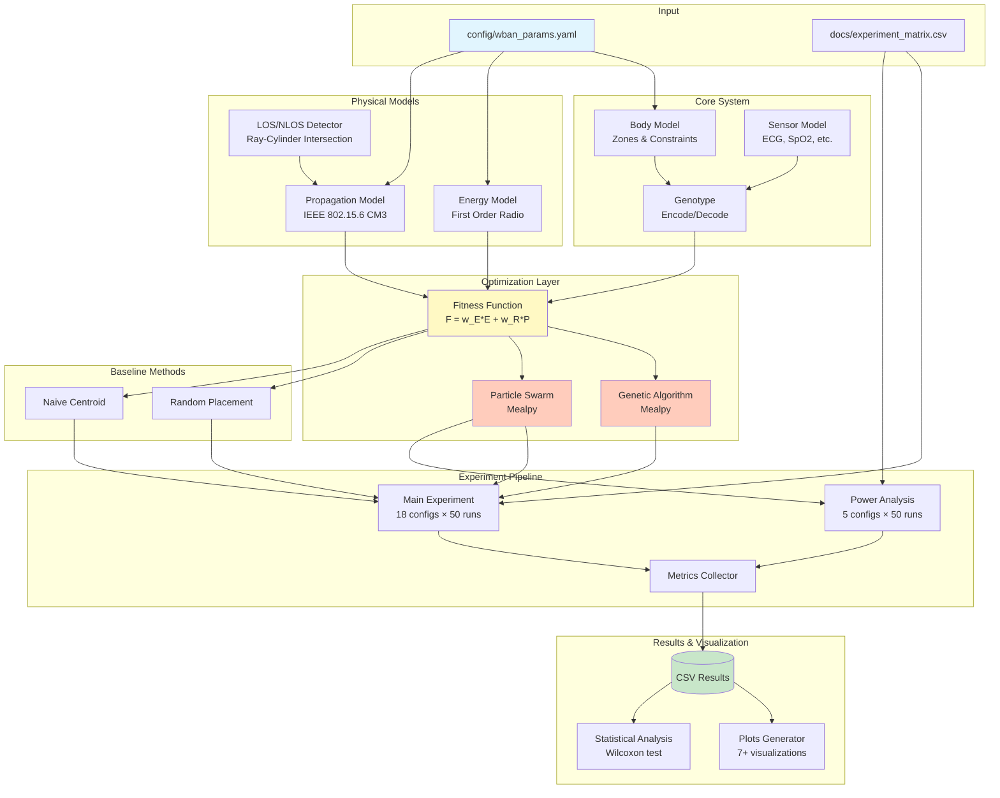
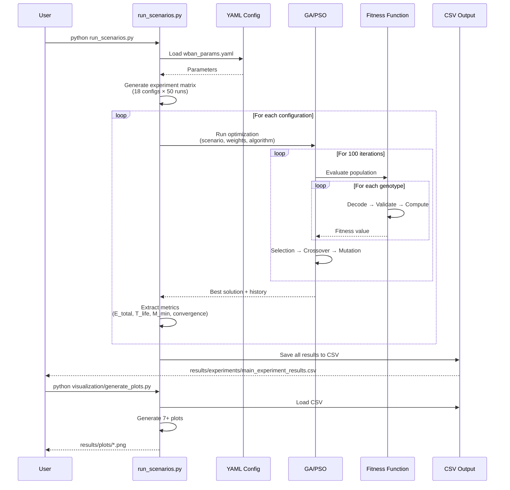
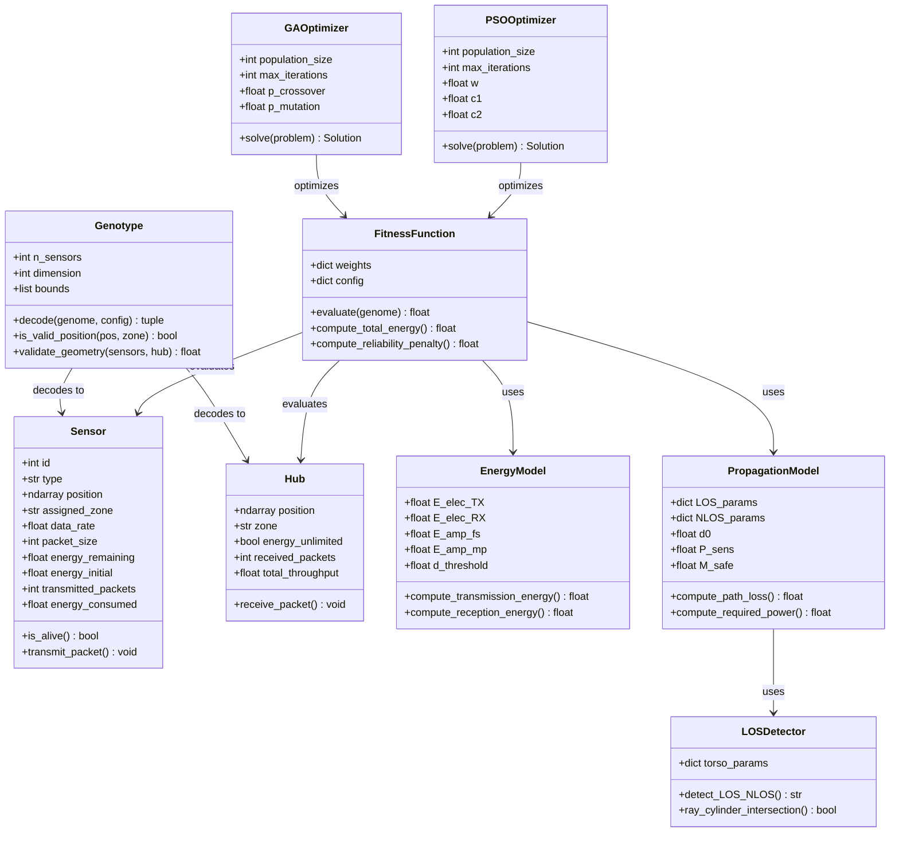
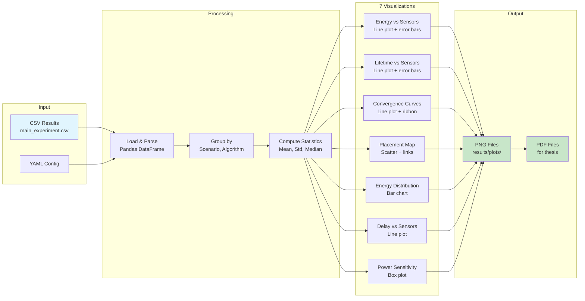
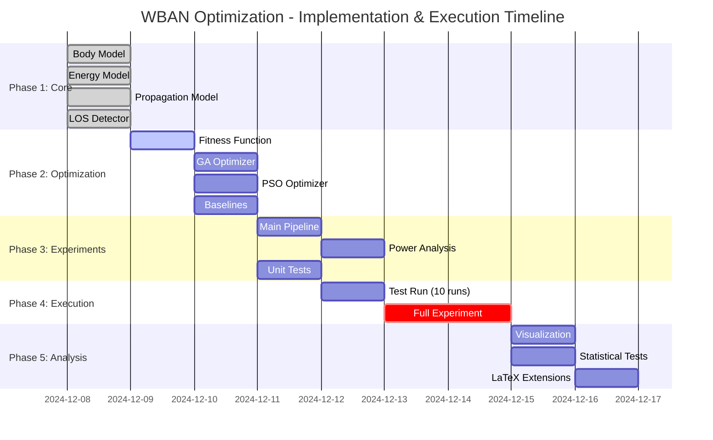

# WBAN Optimization - System Architecture Diagrams

## 1. High-Level System Architecture



## 2. Fitness Function Detailed Flow

```mermaid
graph TD
    START([Genotype g]) --> DECODE[Decode to<br/>Sensors + Hub]
    
    DECODE --> VALID{Geometric<br/>Validation}
    
    VALID -->|Invalid| PENALTY_GEO[P_geo = 1e6<br/>RETURN]
    VALID -->|Valid| LOOP[For Each Sensor]
    
    LOOP --> DIST[Compute Distance<br/>d = ||sensor - hub||]
    DIST --> LOS_DET[Detect LOS/NLOS<br/>Ray-Cylinder Test]
    
    LOS_DET --> PL[Compute Path Loss<br/>PL = PL_d0 + 10*n*log10(d/d0)]
    
    PL --> PTX[Required TX Power<br/>P_TX_req = P_sens + PL + M_safe]
    
    PTX --> MARGIN[Link Margin<br/>M = P_TX_max - P_TX_req]
    
    MARGIN --> ENERGY[Transmission Energy<br/>E_TX = E_elec + E_amp*d^α]
    
    ENERGY --> ACCUM[Accumulate<br/>E_total += E_TX]
    
    ACCUM --> MORE{More<br/>Sensors?}
    MORE -->|Yes| LOOP
    More -->|No| CHECK_REL{Min Margin<br/>< 0?}
    
    CHECK_REL -->|Yes| PENALTY_REL[P_rel = |M_min| × 100]
    CHECK_REL -->|No| NO_PENALTY[P_rel = 0]
    
    PENALTY_REL --> AGGREGATE
    NO_PENALTY --> AGGREGATE
    
    AGGREGATE[F = w_E × E_total + w_R × P_rel]
    
    AGGREGATE --> RETURN([Return Fitness F])
    
    style START fill:#e1f5fe
    style RETURN fill:#c8e6c9
    style PENALTY_GEO fill:#ffcdd2
    style PENALTY_REL fill:#ffcdd2
    style AGGREGATE fill:#fff9c4
```

## 3. LOS/NLOS Detection Algorithm

```mermaid
graph TD
    START([Sensor Pos<br/>Hub Pos]) --> PARAMS[Load Torso Params<br/>center_x, center_y, R]
    
    PARAMS --> RAY[Compute Ray<br/>origin = sensor<br/>direction = hub - sensor]
    
    RAY --> TEST1{Sensor or Hub<br/>inside cylinder?}
    
    TEST1 -->|Yes| NLOS1[RETURN: NLOS]
    TEST1 -->|No| DIST_CALC[Calculate Distance<br/>from ray to<br/>cylinder center]
    
    DIST_CALC --> TEST2{Distance < R?}
    
    TEST2 -->|No| LOS1[RETURN: LOS]
    TEST2 -->|Yes| TTEST[Find closest point<br/>on ray to center]
    
    TTEST --> TEST3{t_closest in<br/>[0, ray_length]?}
    
    TEST3 -->|No| LOS2[RETURN: LOS]
    TEST3 -->|Yes| NLOS2[RETURN: NLOS]
    
    style START fill:#e1f5fe
    style NLOS1 fill:#ffcdd2
    style NLOS2 fill:#ffcdd2
    style LOS1 fill:#c8e6c9
    style LOS2 fill:#c8e6c9
```

## 4. Experiment Execution Flow



## 5. Data Model Class Diagram



## 6. Visualization Pipeline



## 7. Deployment Timeline (Gantt Chart)



---

## How to Use These Diagrams

### In Thesis (LaTeX):

1. **Architecture Diagram** → Rozdział 4.1 (Architektura systemu)
2. **Fitness Flow** → Rozdział 2.3.3 (Funkcja celu - szczegóły)
3. **LOS/NLOS Algorithm** → Rozdział 2.2.2 (Detekcja przesłonięcia)
4. **Class Diagram** → Rozdział 4.2 (Implementacja - struktura klas)

### Rendering Diagrams:

```bash
# Online: https://mermaid.live/
# Paste diagram code → Export as PNG/SVG

# Local (if you have mermaid-cli):
mmdc -i diagrams.md -o diagram1.png
```

### Integration with LaTeX:

```latex
\begin{figure}[htbp]
\centering
\includegraphics[width=0.8\textwidth]{figures/system_architecture.png}
\caption{Architektura systemu optymalizacji WBAN. Pokazano główne moduły: model ciała, modele fizyczne (energia, propagacja), algorytmy optymalizacyjne (GA, PSO) oraz pipeline eksperymentów.}
\label{fig:architecture}
\end{figure}
```

---

**Note:** Te diagramy można również wygenerować programowo w Python używając biblioteki `diagrams`:

```python
from diagrams import Diagram, Cluster
from diagrams.generic.compute import Rack
from diagrams.programming.flowchart import Decision

# Diagram architecture
with Diagram("WBAN System", show=False):
    # ... (similar structure)
```
